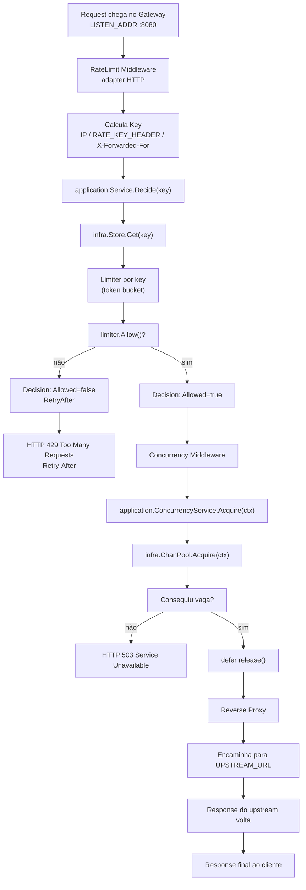

# Estudando 00

O **store.go** é um “tipo de dados” (**uma struct**) com estado (mapa de limiters, config, mutex, TTL) e métodos (Get, Cleanup, StartJanitor, etc.).

Quando você cria `store := infra.NewStore(...)`, você está criando um “**componente**” que guarda e fornece **limiters por chave** (IP/api-key). Ele é a **infra** que o resto do sistema usa.

* **O middleware**
É o que “aplica” a funcionalidade no tráfego HTTP. Ele não decide o algoritmo do bucket em si; ele:
* pega a **chave** (IP/header),
* chama a **camada de aplicação** `(application.Service.Decide(...))`,
traduz a decisão para HTTP (`429` + headers) e/ou chama o próximo handler.
* **A camada de aplicação é quem centraliza a regra do “pode/não pode”**
Hoje a regra “se o limiter permitir, segue; senão bloqueia com Retry-After” fica em:
`service.go`

Então, de forma resumida:
* **infra** (`Store`) = “onde e como guardo/implemento os limiters”
* **application** (`Service`) = “regra de negócio: permitir ou bloquear (e Retry-After)”
* **adapter HTTP** (`middleware`) = “como extrair dados da request e responder 429/503”

## Diagrama de Fluxo do caminho da requisição no gateway

Fluxo (rate limit + concorrência + proxy)

